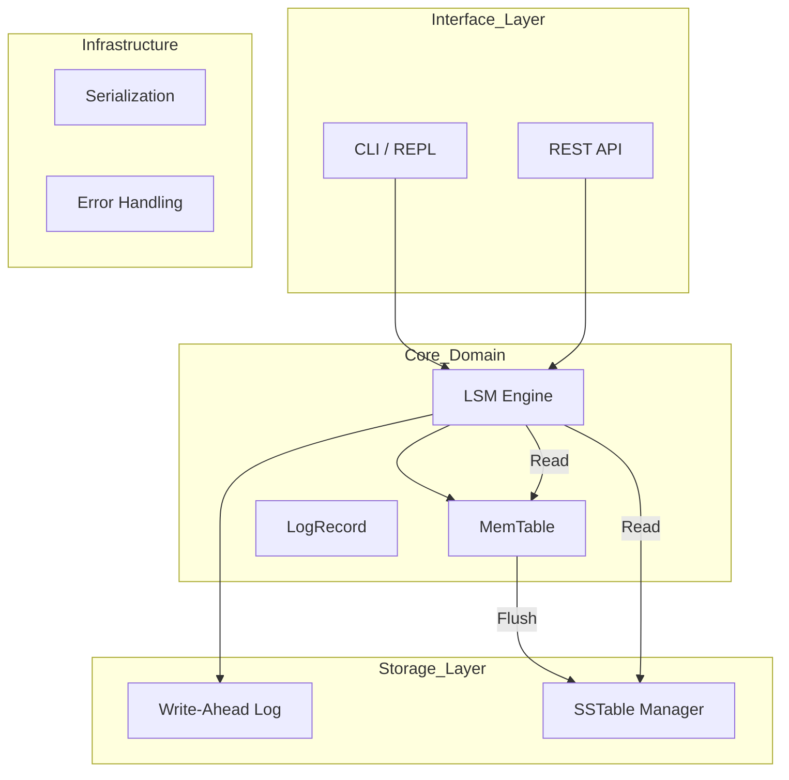

# 🦀 LSM KV Store

[](https://www.rust-lang.org/)
[](LICENSE)

> **A high-performance, embedded key-value store written in Rust, now with a modular SOLID architecture.**

Este projeto é uma implementação da arquitetura **Log-Structured Merge-Tree (LSM-Tree)**, focada em alto throughput de escrita e durabilidade. Recentemente, o projeto foi reestruturado seguindo os princípios **SOLID** para garantir testabilidade, separação de preocupações e facilidade de manutenção.

---

## 🏗 Arquitetura & Design

A engine agora utiliza um design modular onde cada componente possui uma responsabilidade única, facilitando a substituição de implementações (ex: trocar Bincode por Protobuf ou BTreeMap por SkipList).



### 📂 Estrutura de Pastas (SOLID)

| Diretório       | Responsabilidade                                                       | Princípio Aplicado              |
| :-------------- | :--------------------------------------------------------------------- | :------------------------------ |
| `src/core/`     | **O Cérebro.** Contém a Engine, MemTable e definição de registros.     | **SRP** (Single Responsibility) |
| `src/storage/`  | **Persistência.** Gerencia a escrita física (WAL) e o formato SSTable. | **DIP** (Dependency Inversion)  |
| `src/infra/`    | **Utilidades.** Tratamento de erros global e lógica de serialização.   | **Separation of Concerns**      |
| `src/features/` | **Domínio de Negócio.** Gerenciamento de Feature Flags com cache.      | **Modularity**                  |
| `src/api/`      | **Transporte.** Servidor REST Actix-Web e Handlers.                    | **Decoupling**                  |
| `src/cli/`      | **Interface.** Implementação do REPL interativo.                       | **Isolation**                   |

---

## 🚀 Como Iniciar

### Pré-requisitos

- Rust 1.70+

### Instalação & Execução

```bash
# Clone o repositório
git clone https://github.com/ElioNeto/lsm-kv-store.git
cd lsm-kv-store

# Modo CLI Interativo
cargo run --release

# Modo Servidor API (com Feature Flags)
cargo run --release --features api
```

---

## 🌐 API & Gerenciamento de Features

A API agora inclui suporte nativo para **Feature Flags**, permitindo habilitar/desabilitar funcionalidades em tempo de execução sem reiniciar o banco.

### Endpoints Principais

| Método | Endpoint         | Descrição                                            |
| :----- | :--------------- | :--------------------------------------------------- |
| `GET`  | `/keys/{key}`    | Busca um valor pela chave.                           |
| `POST` | `/keys`          | Insere ou atualiza um par chave-valor.               |
| `GET`  | `/stats/all`     | Telemetria completa (Mem, Disk, WAL).                |
| `GET`  | `/features`      | Lista todas as Feature Flags configuradas.           |
| `POST` | `/features/{id}` | Cria ou atualiza uma flag (ex: `{"enabled": true}`). |

---

## ⚡ Decisões de Design (v2.0)

1.  **Inversão de Dependência:** O `LsmEngine` não gerencia mais arquivos diretamente; ele delega para `WriteAheadLog` e `SstableManager`, facilitando o mock para testes unitários.
2.  **Robustez no Codec:** Centralizamos a serialização em `infra/codec.rs`, garantindo que todo o sistema utilize consistentemente _Little Endian_ e codificação de inteiros fixos.
3.  **Performance:** Mantivemos o uso de **Bloom Filters** nas SSTables para evitar IO desnecessário em chaves inexistentes.
4.  **Optimistic Locking:** O sistema de Feature Flags implementa controle de versão para evitar condições de corrida em atualizações concorrentes.

---

## 🗺️ Roadmap

- [x] **Arquitetura SOLID** (Reestruturação completa de módulos)
- [x] **Feature Flags System** (Gerenciamento dinâmico persistido no LSM)
- [ ] **v2: Indexação Esparsa** (Reduzir tempo de busca em arquivos SST grandes)
- [ ] **v3: Estratégia de Compactação** (Leveled Compaction para reduzir amplificação de leitura)

---

## Licença

MIT License - veja [LICENSE](LICENSE) para detalhes.
