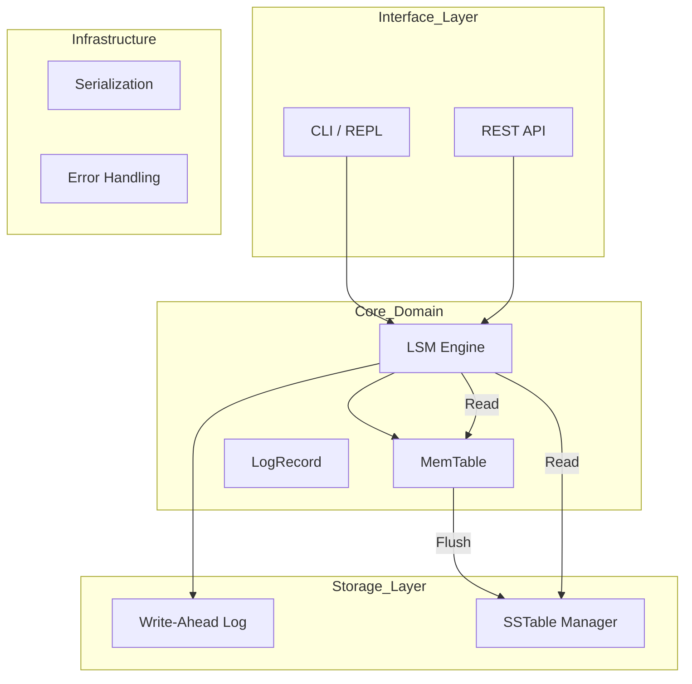

# 🦀 LSM KV Store

[](https://www.rust-lang.org/)
[](LICENSE)

> **A high-performance, embedded key-value store written in Rust, now featuring a modular SOLID architecture.**

This project is an implementation of the **Log-Structured Merge-Tree (LSM-Tree)** architecture, focused on high write throughput and durability. Recently, the project was restructured following **SOLID** principles to ensure testability, separation of concerns, and ease of maintenance.

---

## 🏗 Architecture & Design

The engine now uses a modular design where each component has a single responsibility, making it easy to swap implementations (e.g., replace Bincode with Protobuf or BTreeMap with SkipList).



### 📂 Folder Structure (SOLID)

| Directory       | Responsibility                                                        | Applied Principle               |
| :-------------- | :-------------------------------------------------------------------- | :------------------------------ |
| `src/core/`     | **The Brain.** Contains the Engine, MemTable, and record definitions. | **SRP** (Single Responsibility) |
| `src/storage/`  | **Persistence.** Manages physical writes (WAL) and SSTable format.    | **DIP** (Dependency Inversion)  |
| `src/infra/`    | **Utilities.** Global error handling and serialization logic.         | **Separation of Concerns**      |
| `src/features/` | **Business Domain.** Feature Flag management with caching.            | **Modularity**                  |
| `src/api/`      | **Transport.** Actix-Web REST server and handlers.                    | **Decoupling**                  |
| `src/cli/`      | **Interface.** Interactive REPL implementation.                       | **Isolation**                   |

---

## 🚀 Getting Started

### Prerequisites
- Rust 1.70+ (`curl --proto '=https' --tlsv1.2 -sSf https://sh.rustup.rs | sh`)

- Rust 1.70+

### Installation & Execution

```bash
# Clone the repository
git clone https://github.com/ElioNeto/lsm-kv-store.git
cd lsm-kv-store

# Interactive CLI Mode
cargo run --release

# API Server Mode (with Feature Flags)
cargo run --release --features api
```

---

## 🌐 API & Feature Management

The API now includes native support for **Feature Flags**, allowing you to enable/disable functionality at runtime without restarting the database.

### Main Endpoints

| Method | Endpoint         | Description                                         |
| :----- | :--------------- | :-------------------------------------------------- |
| `GET`  | `/keys/{key}`    | Retrieves a value by key.                           |
| `POST` | `/keys`          | Inserts or updates a key-value pair.                |
| `GET`  | `/stats/all`     | Full telemetry (Memory, Disk, WAL).                 |
| `GET`  | `/features`      | Lists all configured Feature Flags.                 |
| `POST` | `/features/{id}` | Creates or updates a flag (e.g., `{"enabled": true}`). |

---

## ⚡ Design Decisions (v2.0)

1. **Dependency Inversion:** `LsmEngine` no longer manages files directly; it delegates to `WriteAheadLog` and `SstableManager`, making unit testing easier with mocks.  
2. **Codec Robustness:** Serialization is centralized in `infra/codec.rs`, ensuring consistent use of _Little Endian_ and fixed-width integer encoding.  
3. **Performance:** Bloom Filters are used in SSTables to avoid unnecessary IO for non-existent keys.  
4. **Optimistic Locking:** The Feature Flags system implements version control to prevent race conditions during concurrent updates.  

---

## 🗺 Roadmap

- [x] **SOLID Architecture** (Complete module restructuring)  
- [x] **Feature Flags System** (Dynamic management persisted in LSM)  
- [ ] **v2: Sparse Indexing** (Reduce lookup time in large SST files)  
- [ ] **v3: Compaction Strategy** (Leveled Compaction to reduce read amplification)  

---

## License

MIT License - veja [LICENSE](LICENSE) para detalhes.
