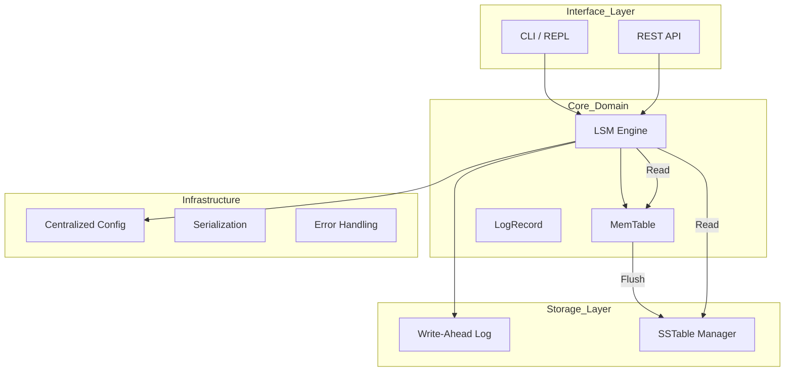

# 🦀 LSM KV Store

[](https://www.rust-lang.org/)
[](LICENSE)
[](https://github.com/ElioNeto/lsm-kv-store/actions)

> **A high-performance, embedded key-value store written in Rust, featuring a modular SOLID architecture and centralized configuration system.**

This project implements the **Log-Structured Merge-Tree (LSM-Tree)** architecture, optimized for high write throughput and durability. The codebase follows **SOLID principles** to ensure testability, separation of concerns, and maintainability.

---

## ✨ Key Features

- 🚀 **High Performance**: Optimized write throughput with WAL and MemTable
- 📦 **LSM-Tree Architecture**: Efficient storage with automatic flushing to SSTables
- 🔍 **Bloom Filters**: Fast negative lookups without disk I/O
- 🛡️ **ACID Guarantees**: Write-Ahead Log ensures durability
- 🧩 **Modular Design**: Clean SOLID architecture with dependency inversion
- ⚙️ **Centralized Configuration**: Flexible builder pattern with sensible defaults
- 🌐 **REST API**: Full-featured HTTP interface with Actix-Web
- 🚩 **Feature Flags**: Dynamic runtime feature management
- 📊 **Statistics**: Comprehensive metrics and telemetry

---

## 🏛️ Architecture & Design

The engine uses a modular design where each component has a single responsibility, making it easy to swap implementations.



### 📂 Folder Structure (SOLID)

| Directory       | Responsibility                                                        | Applied Principle               |
| :-------------- | :-------------------------------------------------------------------- | :------------------------------ |
| `src/core/`     | **The Brain.** Contains the Engine, MemTable, and record definitions. | **SRP** (Single Responsibility) |
| `src/storage/`  | **Persistence.** Manages physical writes (WAL) and SSTable format.    | **DIP** (Dependency Inversion)  |
| `src/infra/`    | **Utilities.** Config, error handling, and serialization logic.       | **Separation of Concerns**      |
| `src/features/` | **Business Domain.** Feature Flag management with caching.            | **Modularity**                  |
| `src/api/`      | **Transport.** Actix-Web REST server and handlers.                    | **Decoupling**                  |
| `src/cli/`      | **Interface.** Interactive REPL implementation.                       | **Isolation**                   |

---

## 🚀 Getting Started

### Prerequisites

- **Rust 1.70+**
  ```bash
  curl --proto '=https' --tlsv1.2 -sSf https://sh.rustup.rs | sh
  ```

### Installation & Execution

```bash
# Clone the repository
git clone https://github.com/ElioNeto/lsm-kv-store.git
cd lsm-kv-store

# Interactive CLI Mode
cargo run --release

# API Server Mode (with Feature Flags)
cargo run --release --features api --bin lsm-server

# Run examples
cargo run --example demo
cargo run --example basic

# Run tests
cargo test --all-features
```

---

## ⚙️ Configuration

The project now features a **centralized configuration system** with a flexible builder pattern.

### Basic Usage

```rust
use lsm_kv_store::{LsmConfig, LsmEngine};

// Using defaults
let config = LsmConfig::default();
let engine = LsmEngine::new(config)?;

// Using builder pattern
let config = LsmConfig::builder()
    .dir_path("/var/lib/lsm_data")
    .memtable_max_size(8 * 1024 * 1024)  // 8MB
    .block_size(8192)
    .block_cache_size_mb(128)
    .build();

let engine = LsmEngine::new(config)?;
```

### Configuration Options

#### Core Config
- **`dir_path`**: Data directory path (default: `./.lsmdata`)
- **`memtable_max_size`**: MemTable size limit in bytes (default: 4MB)

#### Storage Config
- **`block_size`**: Block size for SSTables (default: 4096)
- **`block_cache_size_mb`**: Block cache size in MB (default: 64)
- **`sparse_index_interval`**: Sparse index interval (default: 16)
- **`bloom_false_positive_rate`**: Bloom filter FP rate (default: 0.01)

### Environment Variables (Server Mode)

```bash
DATA_DIR="/var/lib/lsm_data" \
HOST="0.0.0.0" \
PORT="8080" \
cargo run --release --features api --bin lsm-server
```

---

## 🌐 API & Feature Management

The API includes native support for **Feature Flags**, allowing runtime configuration without restarts.

### Main Endpoints

#### Key-Value Operations
| Method   | Endpoint              | Description                          |
| :------- | :-------------------- | :----------------------------------- |
| `GET`    | `/keys/{key}`         | Retrieve value by key                |
| `POST`   | `/keys`               | Insert or update key-value pair      |
| `DELETE` | `/keys/{key}`         | Delete a key                         |
| `POST`   | `/keys/batch`         | Batch insert multiple keys           |
| `DELETE` | `/keys/batch`         | Batch delete multiple keys           |
| `GET`    | `/keys`               | List all keys                        |
| `GET`    | `/scan`               | Get all key-value pairs              |

#### Search Operations
| Method | Endpoint                        | Description                    |
| :----- | :------------------------------ | :----------------------------- |
| `GET`  | `/keys/search?q={query}`        | Search by substring            |
| `GET`  | `/keys/search?q={query}&prefix=true` | Search by prefix        |

#### Statistics
| Method | Endpoint      | Description                           |
| :----- | :------------ | :------------------------------------ |
| `GET`  | `/stats`      | Basic statistics                      |
| `GET`  | `/stats/all`  | Full telemetry (Memory, Disk, WAL)    |
| `GET`  | `/health`     | Health check                          |

#### Feature Flags
| Method   | Endpoint           | Description                              |
| :------- | :----------------- | :--------------------------------------- |
| `GET`    | `/features`        | List all configured Feature Flags        |
| `POST`   | `/features/{id}`   | Create or update flag (e.g., `{"enabled": true}`) |

---

## 💡 Usage Examples

### Basic Operations

```rust
use lsm_kv_store::{LsmConfig, LsmEngine};

fn main() -> Result<(), Box<dyn std::error::Error>> {
    let config = LsmConfig::default();
    let engine = LsmEngine::new(config)?;

    // Insert
    engine.set("user:1".to_string(), b"Alice".to_vec())?;
    
    // Retrieve
    if let Some(value) = engine.get("user:1")? {
        println!("Value: {}", String::from_utf8_lossy(&value));
    }
    
    // Delete
    engine.delete("user:1".to_string())?;
    
    // Batch operations
    engine.set_batch(vec![
        ("key1".to_string(), b"value1".to_vec()),
        ("key2".to_string(), b"value2".to_vec()),
    ])?;
    
    // Search
    let results = engine.search_prefix("user:")?;
    
    // Statistics
    println!("{}", engine.stats());
    
    Ok(())
}
```

### REST API Examples

```bash
# Insert a key
curl -X POST http://localhost:8080/keys \
  -H "Content-Type: application/json" \
  -d '{"key": "user:1", "value": "Alice"}'

# Get a key
curl http://localhost:8080/keys/user:1

# Search by prefix
curl "http://localhost:8080/keys/search?q=user:&prefix=true"

# Get statistics
curl http://localhost:8080/stats/all

# Batch insert
curl -X POST http://localhost:8080/keys/batch \
  -H "Content-Type: application/json" \
  -d '[{"key": "k1", "value": "v1"}, {"key": "k2", "value": "v2"}]'
```

---

## ⚡ Design Decisions

1. **Dependency Inversion**: `LsmEngine` delegates to `WriteAheadLog` and `SstableManager`, enabling easy unit testing with mocks.
2. **Centralized Configuration**: All configuration unified in `infra/config.rs` with builder pattern for flexibility.
3. **Codec Robustness**: Serialization centralized in `infra/codec.rs`, ensuring consistent Little Endian encoding.
4. **Performance**: Bloom Filters prevent unnecessary disk I/O for non-existent keys.
5. **Feature Flags**: Optimistic locking with version control prevents race conditions during concurrent updates.

---

## 📊 Performance Characteristics

- **Write**: O(log n) - MemTable insertion
- **Read**: O(log n) - MemTable + SSTable lookup with Bloom filter optimization
- **Scan**: O(n) - Merges MemTable and SSTables
- **Space**: Efficient with automatic flushing and future compaction support

---

## 🗺️ Roadmap

See [ROADMAP.md](ROADMAP.md) for detailed future plans.

### Completed
- [x] **SOLID Architecture** - Complete module restructuring
- [x] **Centralized Configuration** - Builder pattern with sensible defaults
- [x] **Feature Flags System** - Dynamic management persisted in LSM
- [x] **REST API** - Full CRUD operations with statistics
- [x] **Write-Ahead Log** - Durability guarantees
- [x] **Bloom Filters** - Read optimization

### In Progress
- [ ] **Sparse Indexing** - Reduce lookup time in large SST files
- [ ] **Compaction Strategy** - Leveled compaction to reduce read amplification

### Planned
- [ ] **Multi-instance Support** - Run multiple isolated engines
- [ ] **Advanced Iterators** - Efficient range queries
- [ ] **Secondary Indexes** - Query without full scans

---

## 📝 Documentation

- [CHANGELOG.md](CHANGELOG.md) - Detailed change history and migration guides
- [ROADMAP.md](ROADMAP.md) - Future development plans
- [API Documentation](https://docs.rs/lsm-kv-store) - Full API reference

---

## 🧪 Testing

```bash
# Run all tests
cargo test --all-features

# Run specific test
cargo test restart_recovers_from_wal

# Run with output
cargo test -- --nocapture

# Run benchmarks (if available)
cargo bench
```

---

## 🤝 Contributing

Contributions are welcome! Please feel free to submit a Pull Request. For major changes:

1. Fork the repository
2. Create your feature branch (`git checkout -b feature/AmazingFeature`)
3. Commit your changes (`git commit -m 'Add some AmazingFeature'`)
4. Push to the branch (`git push origin feature/AmazingFeature`)
5. Open a Pull Request

---

## 📜 License

This project is licensed under the MIT License - see the [LICENSE](LICENSE) file for details.

---

## 👥 Authors

- **Elio Neto** - [@ElioNeto](https://github.com/ElioNeto)

---

## 🚀 Acknowledgments

- Inspired by RocksDB, LevelDB, and Cassandra's LSM-Tree implementations
- Built with Rust's amazing ecosystem: Actix-Web, Serde, Tracing
- Thanks to the Rust community for excellent documentation and support

---

**⭐ If you find this project useful, please consider giving it a star!**
