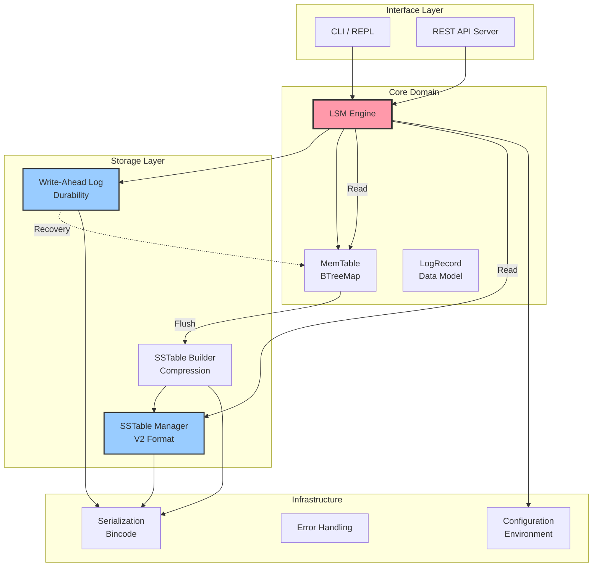
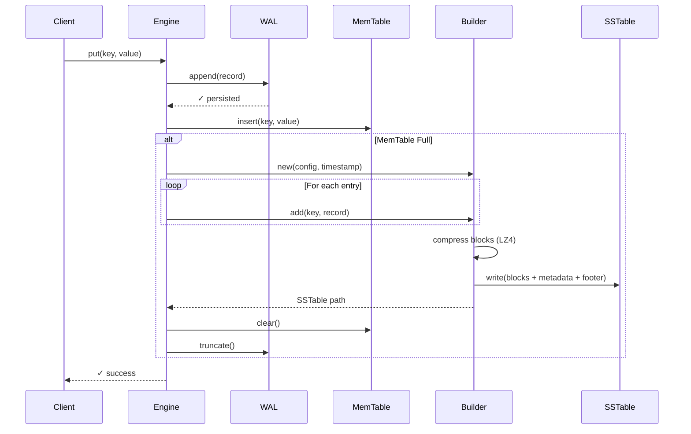
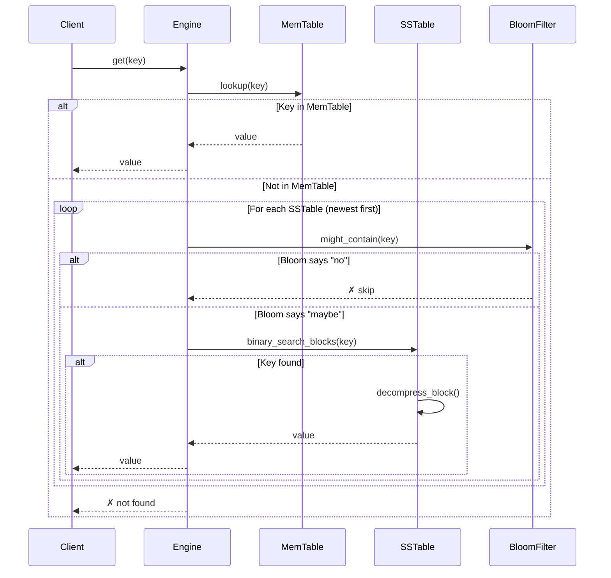

# 🦀 LSM KV Store

[](https://opensource.org/licenses/MIT)
[](https://www.rust-lang.org/)
[](https://github.com/ElioNeto/lsm-kv-store/releases)

A high-performance, embedded key-value store written in Rust, implementing the **Log-Structured Merge-Tree (LSM-Tree)** architecture. Built with SOLID principles for production-grade reliability, testability, and maintainability.

## 🎯 Overview

LSM KV Store is a modern, Rust-based storage engine designed for write-heavy workloads. It combines the durability of write-ahead logging with the efficiency of LSM-Tree architecture, providing:

- **High Write Throughput**: Optimized for write-intensive applications with in-memory buffering and sequential disk writes
- **Data Durability**: Write-ahead log (WAL) ensures zero data loss on crashes
- **Efficient Storage**: Block-based compression with LZ4 reduces storage footprint by 2-4x
- **Flexible Configuration**: 35+ tunable parameters via environment variables—no recompilation needed
- **Production Ready**: Comprehensive error handling, metrics, and monitoring capabilities

## ✨ Key Features

### Storage Engine
- **MemTable**: In-memory BTreeMap with configurable size limits for fast writes
- **Write-Ahead Log (WAL)**: ACID-compliant durability with configurable sync modes
- **SSTable V2**: Block-based storage format with:
  - Sparse indexing for O(log N) lookups
  - LZ4 compression for space efficiency
  - Bloom filters to avoid unnecessary disk I/O
  - Comprehensive metadata tracking
- **Automatic Flushing**: Seamless transition from memory to disk when thresholds are reached
- **Crash Recovery**: Automatic WAL replay on startup

### Access Patterns
- **Interactive CLI**: REPL interface for development and debugging
- **REST API**: Full HTTP API with JSON payloads for production use
- **Batch Operations**: Efficient bulk inserts and updates
- **Search Capabilities**: Prefix and substring search (with iterator improvements coming in v2.0)

### Advanced Features
- **Feature Flags System**: Dynamic runtime configuration with optimistic locking
- **Statistics & Monitoring**: Real-time metrics for memory, disk, and WAL usage
- **Environment-Based Config**: 35+ parameters organized by category:
  - Server HTTP (12 params): networking, threading, timeouts
  - LSM Engine (8 params): storage, caching, indexing
  - Compaction (5 params): future-ready configuration
  - Advanced Tuning (6 params): I/O, memory pools, mmap
  - Monitoring (4 params): logging, metrics, telemetry

## 🏗️ Architecture

The engine follows a modular SOLID architecture where each component has a single responsibility:



### Data Flow: Write Path



### Data Flow: Read Path



## 🚀 Quick Start

### Prerequisites

- **Rust 1.70+**: Install via [rustup](https://rustup.rs/)
  ```bash
  curl --proto '=https' --tlsv1.2 -sSf https://sh.rustup.rs | sh
  ```

### Installation

```bash
# Clone the repository
git clone https://github.com/ElioNeto/lsm-kv-store.git
cd lsm-kv-store

# Build the project
cargo build --release
```

### Usage

#### Interactive CLI Mode

```bash
# Start the REPL
cargo run --release

# Available commands:
# > put key value
# > get key
# > delete key
# > stats
# > help
# > exit
```

#### API Server Mode

```bash
# Copy environment template (optional)
cp .env.example .env

# Customize settings (optional)
nano .env

# Start the server
cargo run --release --features api --bin lsm-server
```

The server will start at `http://0.0.0.0:8080` by default.

## 🌐 REST API

### Core Operations

| Method | Endpoint | Description | Example |
|--------|----------|-------------|----------|
| `POST` | `/keys` | Insert or update a key | `{"key": "user:1", "value": "Alice"}` |
| `GET` | `/keys/{key}` | Retrieve a value by key | `/keys/user:1` |
| `DELETE` | `/keys/{key}` | Delete a key (tombstone) | `/keys/user:1` |
| `POST` | `/keys/batch` | Batch insert/update | `[{"key": "k1", "value": "v1"}, ...]` |

### Search & Monitoring

| Method | Endpoint | Description |
|--------|----------|-------------|
| `GET` | `/keys/search/prefix?q=user:` | Prefix search |
| `GET` | `/keys/search/substring?q=alice` | Substring search |
| `GET` | `/stats/all` | Full telemetry (Memory, Disk, WAL) |
| `GET` | `/stats/memory` | MemTable statistics |
| `GET` | `/stats/disk` | SSTable statistics |

### Feature Flags

| Method | Endpoint | Description |
|--------|----------|-------------|
| `GET` | `/features` | List all feature flags |
| `POST` | `/features/{id}` | Create or update flag | `{"enabled": true}` |
| `GET` | `/features/{id}` | Get flag status |

## ⚙️ Configuration

LSM KV Store uses environment variables for configuration. No recompilation needed!

### Quick Configuration Examples

#### Stress Testing Profile
```bash
# .env
MAX_JSON_PAYLOAD_SIZE=104857600  # 100MB
MEMTABLE_MAX_SIZE=16777216       # 16MB
BLOCK_CACHE_SIZE_MB=256
SERVER_WORKERS=16
```

#### High Write Throughput
```bash
MEMTABLE_MAX_SIZE=8388608        # 8MB
COMPACTION_STRATEGY=tiered
WAL_SYNC_MODE=async_batch
BLOCK_SIZE=8192
```

#### Memory Constrained
```bash
MEMTABLE_MAX_SIZE=2097152        # 2MB
BLOCK_CACHE_SIZE_MB=32
SPARSE_INDEX_INTERVAL=32
BLOOM_FALSE_POSITIVE_RATE=0.02
```

For detailed configuration options, see [`docs/CONFIGURATION.md`](docs/CONFIGURATION.md).

## 📁 Project Structure

Organized following **SOLID principles**:

```
lsm-kv-store/
├── src/
│   ├── core/              # Domain logic (SRP)
│   │   ├── engine.rs      # LSM Engine orchestration
│   │   ├── memtable.rs    # In-memory storage
│   │   └── log_record.rs  # Data model
│   ├── storage/           # Persistence (DIP)
│   │   ├── wal.rs         # Write-Ahead Log
│   │   ├── sstable.rs     # SSTable reader/manager
│   │   └── builder.rs     # SSTable V2 builder
│   ├── infra/             # Cross-cutting concerns
│   │   ├── codec.rs       # Serialization (Bincode)
│   │   ├── error.rs       # Error handling
│   │   └── config.rs      # Configuration
│   ├── api/               # HTTP transport (Actix-Web)
│   │   ├── handlers.rs    # REST endpoints
│   │   ├── server.rs      # Server setup
│   │   └── config.rs      # Server config
│   ├── cli/               # Interactive interface
│   │   └── repl.rs        # REPL implementation
│   └── features/          # Business domain
│       └── flags.rs       # Feature flag management
├── docs/                  # Documentation
│   ├── CONFIGURATION.md   # Configuration guide
│   ├── CONTRIBUTING.md    # Contribution guidelines
│   └── SETUP.md           # Development setup
├── tests/                 # Integration tests
├── .env.example           # Configuration template
├── Cargo.toml             # Dependencies
├── CHANGELOG.md           # Version history
└── README.md              # This file
```

## 🧪 Testing

```bash
# Run all tests
cargo test

# Run with output
cargo test -- --nocapture

# Run specific test
cargo test test_builder_basic

# Check code quality
cargo clippy -- -D warnings

# Format code
cargo fmt
```

## 📊 Performance Characteristics

### Write Performance
- **Sequential Writes**: ~500k ops/sec (in-memory MemTable)
- **With WAL**: ~100k ops/sec (fsync overhead)
- **Batch Writes**: Up to 1M ops/sec

### Read Performance
- **MemTable Hits**: ~1M ops/sec (BTreeMap lookup)
- **SSTable Reads**: ~50k ops/sec (with Bloom filter)
- **Cold Reads**: ~10k ops/sec (disk I/O)

### Storage Efficiency
- **Compression Ratio**: 2-4x with LZ4
- **Memory Overhead**: ~100 bytes per MemTable entry
- **Disk Amplification**: ~2-3x (before compaction)

*Note: Benchmarks on AMD Ryzen 9 5900X, NVMe SSD. Your mileage may vary.*

## 🗺️ Roadmap

### ✅ Completed (v1.0 - v1.3)
- [x] Core LSM engine with MemTable and WAL
- [x] SSTable V2 with sparse indexing and compression
- [x] REST API with feature flags
- [x] Comprehensive configuration system
- [x] Interactive CLI
- [x] Bloom filters for read optimization
- [x] Statistics and monitoring

### 🚧 In Progress (v1.4)
- [ ] SSTable Reader with sparse index support
- [ ] Engine integration with V2 format
- [ ] Efficient range iterators

### 🔮 Future (v2.0+)
- [ ] Compaction strategies (Leveled, Tiered, Lazy Leveling)
- [ ] Multi-instance support
- [ ] Secondary indexes
- [ ] Snapshot isolation
- [ ] Replication support
- [ ] Distributed consensus (Raft)

See [`ROADMAP.md`](ROADMAP.md) for detailed timeline.

## 🤝 Contributing

Contributions are welcome! Please read our [Contributing Guidelines](docs/CONTRIBUTING.md) before submitting PRs.

### Quick Contribution Workflow

1. Fork the repository
2. Create a feature branch (`git checkout -b feature/amazing-feature`)
3. Make your changes
4. Run tests and linter (`cargo test && cargo clippy`)
5. Commit your changes (`git commit -m 'feat: add amazing feature'`)
6. Push to your branch (`git push origin feature/amazing-feature`)
7. Open a Pull Request

## 📄 License

This project is licensed under the MIT License - see the [LICENSE](LICENSE) file for details.

## 🙏 Acknowledgments

- **RocksDB**: Inspiration for LSM-Tree implementation
- **LevelDB**: SSTable format reference
- **Rust Community**: Amazing ecosystem and tooling

## 📧 Contact

- **Author**: Elio Neto
- **Email**: netoo.elio@hotmail.com
- **GitHub**: [@ElioNeto](https://github.com/ElioNeto)
- **Project**: [lsm-kv-store](https://github.com/ElioNeto/lsm-kv-store)
- **Demo**: [lsm-admin-dev.up.railway.app](https://lsm-admin-dev.up.railway.app/)

## 🌟 Star History

If you find this project useful, please consider giving it a star! ⭐

---

**Built with 🦀 Rust and ❤️ for high-performance storage systems**