# Change Notes: Issue #19 - SSTable Reading via Sparse Index

**Branch:** `feature/19-sparse-index-read`  
**Issue:** [#19 - Task 1.3: Reader and Integration](https://github.com/ElioNeto/lsm-kv-store/issues/19)  
**Status:** ✅ Implementation Complete  
**Date:** February 3, 2026

---

## 📋 Summary

This implementation introduces **lazy loading** and **sparse index-based reading** to the SSTable storage engine, dramatically improving read performance by eliminating the need to load entire SSTable files into memory.

### Key Performance Improvement

**Before:**
- 🐢 Linear scan through all records on every `get()` call
- 💾 Full file read required for each lookup
- ⏱️ O(n) complexity for key lookups

**After:**
- ⚡ Binary search on sparse index + single block read
- 🎯 Only footer + index loaded at initialization
- ⏱️ O(log n) complexity for key lookups

---

## 🏗️ Architecture Changes

### New SSTable File Format


### Data Structures


---

## 🔍 Key Lookup Algorithm

### Binary Search with `partition_point`


### Algorithm Complexity

| Operation | Before | After |
|-----------|--------|-------|
| **Initialization** | O(n) - load all records | O(1) - read footer + index |
| **Key Lookup** | O(n) - linear scan | O(log b + r) - binary search + block scan |
| **Memory Usage** | O(n) - all records | O(b) - only index |

Where:
- `n` = total number of records
- `b` = number of blocks
- `r` = records per block (typically ~10-50 for 4KB blocks)

---

## 🔄 Lazy Loading Flow

```mermaid
sequenceDiagram
    participant App
    participant SStable
    participant Disk
    
    Note over App,Disk: Initialization (Lazy Loading)
    App->>SStable: open(path)
    SStable->>Disk: seek(END - 8 bytes)
    Disk-->>SStable: index_offset
    SStable->>Disk: seek(index_offset) + read
    Disk-->>SStable: Sparse Index (Vec<BlockMeta>)
    SStable->>Disk: seek(0) + read header
    Disk-->>SStable: Bloom Filter + Metadata
    SStable-->>App: SStable instance
    Note over SStable: ⚡ No data blocks loaded!
    
    Note over App,Disk: Key Lookup (On-Demand)
    App->>SStable: get("key_042")
    SStable->>SStable: Check Bloom Filter
    SStable->>SStable: Binary Search Index\npartition_point
    SStable->>Disk: seek(block_offset) + read
    Disk-->>SStable: Single Block (~4KB)
    SStable->>SStable: Linear scan in block
    SStable-->>App: Option<LogRecord>
```



---

## 📝 Code Changes

### 1. New Structures

#### `BlockMeta` - Sparse Index Entry
```rust
#[derive(Clone, Debug, Serialize, Deserialize)]
pub struct BlockMeta {
    pub first_key: String,  // First key in block (for binary search)
    pub offset: u64,         // File offset where block starts
    pub size: u32,           // Block size in bytes
}
```

#### Updated `SStable` Structure
```rust
pub struct SStable {
    pub(crate) metadata: SstableMetadata,
    pub(crate) bloom_filter: Bloom<[u8]>,
    pub(crate) index: Vec<BlockMeta>,    // NEW: Sparse index
    pub(crate) file: File,                // NEW: Open file handle
    pub(crate) path: PathBuf,
}
```

### 2. Core Methods

#### `create()` - Write SSTable with Blocks


- Splits records into **4KB blocks**
- Builds sparse index during block writing
- Writes footer with index offset for fast lookup

#### `open()` - Lazy Initialization


- **Does NOT load data blocks**
- Only reads: Footer → Index → Bloom → Metadata
- File handle kept open for on-demand reads

#### `get()` - Optimized Lookup
```rust
pub fn get(&mut self, key: &str) -> Result<Option<LogRecord>> {
    // 1. Bloom filter check (O(1))
    if !self.bloom_filter.check(key.as_bytes()) {
        return Ok(None);
    }

    // 2. Binary search on index (O(log b))
    let block_idx = self.index.partition_point(|block_meta| {
        block_meta.first_key.as_str() <= key
    });

    // 3. Edge case: key before first block
    if block_idx == 0 {
        return Ok(None);
    }

    // 4. Read single block (O(1) disk I/O)
    let candidate_idx = block_idx - 1;
    let records = self.read_block(&self.index[candidate_idx])?;

    // 5. Linear scan within block (O(r))
    Ok(records.into_iter().find(|r| r.key == key))
}
```

#### `read_block()` - Random Disk Access
```rust
fn read_block(&mut self, block_meta: &BlockMeta) -> Result<Vec<LogRecord>> {
    // Seek to block offset
    self.file.seek(SeekFrom::Start(block_meta.offset))?;
    
    // Read exact block size
    let mut block_data = vec![0u8; block_meta.size as usize];
    self.file.read_exact(&mut block_data)?;
    
    // Deserialize records
    deserialize_block(&block_data)
}
```

---

## 🧪 Testing Strategy

### Unit Tests Added


### Test Cases Covered

1. **`test_sstable_create_and_open`**
   - Creates SSTable with 100 records
   - Verifies sparse index is built
   - Reopens file and validates lazy loading
   - Tests successful and failed lookups

2. **`test_sparse_index_edge_cases`**
   - Key before first block → Returns `None`
   - Key equals first key → Returns `Some`
   - Key after last block → Returns `None`
   - Middle key → Returns `Some`

---

## 🎯 Implementation Checklist

- [x] Alter `Sstable` struct to store `index: Vec<BlockMeta>`
- [x] Implement `Sstable::open(path)` with lazy loading
  - [x] Seek to end - footer size
  - [x] Read index offset
  - [x] Read and deserialize index into RAM
- [x] Implement `read_block(block_meta)` for disk reads
- [x] Refactor `get(key)` method
  - [x] Check Bloom Filter
  - [x] Binary search on index (`partition_point`)
  - [x] Load single block
  - [x] Iterate inside block to find key
- [x] Add unit tests for sparse index functionality
- [x] Maintain backward compatibility (`load()` delegates to `open()`)

---

## 🚀 Performance Implications

### Memory Savings

**Example:** SSTable with 10,000 records

| Component | Before | After | Savings |
|-----------|--------|-------|----------|
| Records in RAM | ~500 KB | 0 KB | **100%** |
| Sparse Index | 0 KB | ~2 KB | - |
| Bloom Filter | ~10 KB | ~10 KB | 0% |
| Metadata | ~1 KB | ~1 KB | 0% |
| **Total** | **~511 KB** | **~13 KB** | **97.5%** |

### Disk I/O Reduction


**Result:** ~99% reduction in data read per lookup!

---

## 🔧 Technical Decisions

### Why `partition_point` over `binary_search_by`?


**`partition_point` advantages:**
- Returns index where predicate becomes false
- No need to handle `Result<Ok, Err>`
- Semantically clearer for "find first block where key > search_key"
- Same O(log n) performance

### Block Size: 4KB

**Rationale:**
- Matches filesystem block size (common)
- Good balance between:
  - Index size (more blocks = larger index)
  - Linear scan overhead (fewer blocks = more records to scan)
- Typical outcome: 10-50 records per block

---

## 🔄 Migration Path

### Backward Compatibility

✅ **Maintained via `load()` method:**
```rust
pub fn load(path: &Path) -> Result<Self> {
    Self::open(path)  // Delegates to new implementation
}
```

### File Format Migration

⚠️ **Breaking Change:** Old SSTable files are incompatible

**Migration strategies:**
1. **Compaction trigger:** Next compaction rewrites in new format
2. **Explicit migration tool:** Batch convert old SSTables
3. **Version detection:** Check magic bytes and handle both formats

---

## 📚 References

- **Issue:** [#19 - Task 1.3: Reader and Integration](https://github.com/ElioNeto/lsm-kv-store/issues/19)
- **Branch:** [`feature/19-sparse-index-read`](https://github.com/ElioNeto/lsm-kv-store/tree/feature/19-sparse-index-read)
- **Commit:** [beb72c3](https://github.com/ElioNeto/lsm-kv-store/commit/beb72c31e6fe244db19d9e7a54ec60d8ddde162d)

### Related Documentation

- [LSM-Tree Architecture](https://en.wikipedia.org/wiki/Log-structured_merge-tree)
- [Sparse Index Design Pattern](https://www.cs.cornell.edu/courses/cs4320/2023sp/notes/19-indexes.html)
- [Rust `partition_point` Documentation](https://doc.rust-lang.org/std/primitive.slice.html#method.partition_point)

---

## 🎓 Key Learnings

### Performance Optimization Principles

1. **Lazy Loading:** Don't load what you don't need
2. **Sparse Indexing:** Trade small index overhead for massive data reduction
3. **Binary Search:** O(log n) beats O(n) at scale
4. **Block-Based I/O:** Aligned with filesystem for efficiency

### Rust-Specific Patterns

1. **`partition_point`:** Elegant solution for "find first where" queries
2. **Mutable borrows:** `get(&mut self)` required for file I/O
3. **Error propagation:** `?` operator throughout for clean error handling
4. **Ownership:** File handle stored in struct for lifetime management

---

## 👥 Reviewer Notes

### Areas for Review

1. **Error Handling:** Verify all I/O errors are properly propagated
2. **Edge Cases:** Test with:
   - Empty blocks (shouldn't happen but validate)
   - Single-record blocks
   - Maximum block size scenarios
3. **Concurrency:** Current implementation is single-threaded (file handle not thread-safe)
4. **Performance:** Benchmark against old implementation

### Future Enhancements

- [ ] Block compression (LZ4/Snappy)
- [ ] Block caching layer (LRU cache)
- [ ] Parallel block reads for range queries
- [ ] Configurable block size
- [ ] Multi-level indexing for very large SSTables

---

**Implementation Status:** ✅ Complete and Ready for Review  
**Next Steps:** Create Pull Request → Code Review → Merge to `main`
